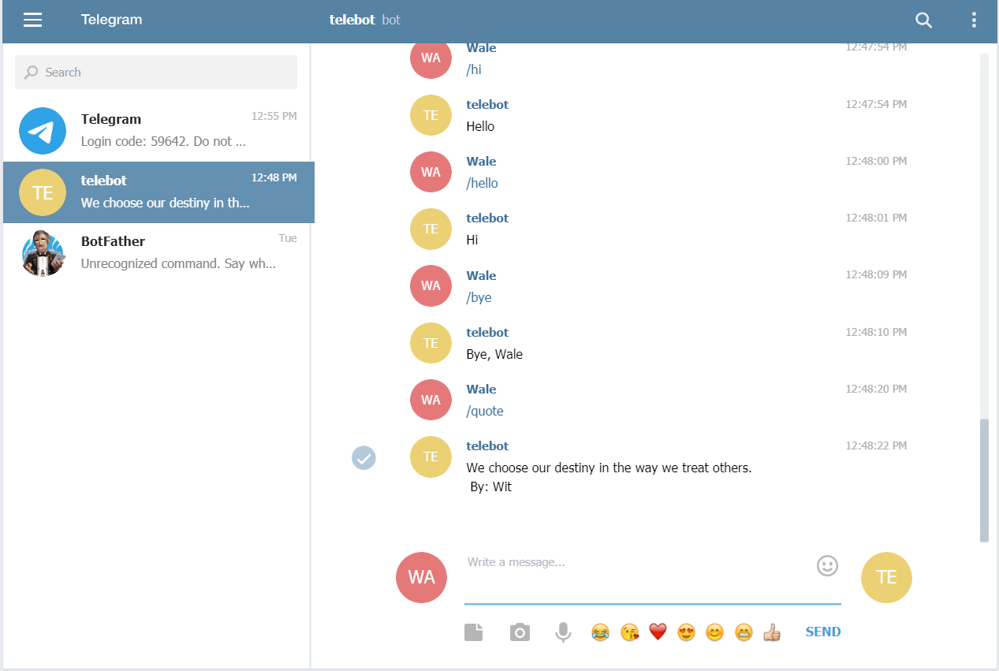
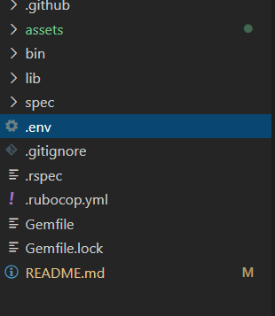

# Telegram_bot(@wales_telebot)



> A telegram bot that can be initialized on the command line
 It responds to commands - ```/hello```, ```/quote```, ```/joke```, ```/hi```, ```/help```, or ```/bye```.

## Purpose

> This is a capstone/assessment project for the ruby module microverse curriculum .

## Features

- The bot has two main features
- It gives you the random jokes based on the name given to it.
- It diplays motivational quotes.

### Commands To Use

```console
/help
```

```console
/hello
```

```console
/hi
```

 ```console
/start
```

 ```console
/bye
```

 ```console
/quote
```

 ```console
/joke
```

## Built With

- Ruby
- Telegram Bot API
- Type fit Quotes API
- Chuck Norris Jokes API
- Type Fit Quotes API

### Requirements
- A computer
- Ruby. [Installing Ruby](https://www.ruby-lang.org/en/documentation/installation/)
- Telegram account
- A telegram Chat bot API

### Getting Started

- Get a local copy of this repo
  Open a terminal and run:```git clone git@github.com:OlawaleJoseph/telebot.git```
- Navigate to your telegram account if you have one. Or create new telegram account.
- Create a new bot with the help of [BotFather](https://t.me/botfather)
- Obtain your new bot's token.
- Create .env file in the root directory.

  
- In the .env file create a variable as indicated the .env.example file
- Open a terminal and run ```bunle install```
- After successful installation run the command ```ruby bin/main.rb```

- On your telegram account search for your bot's name

- Then use the commands above to begin interacting.

## Dependencies

- telegram-bot-ruby
- dotenv
- httparty


## Testing

Install Rspec gem in your system.

Open Command Prompt or Terminal and run: ```gem install Rspec```

Navigate into the project folder and run the following command in the console: ```rspec```


## Contributor

👤 **Adedeko Olawale**

- Github: [@OlawaleJoseph](https://github.com/OlawaleJoseph)
- Twitter: [@javanode123](https://twitter.com/javanode123)
- Linkedin: [olawale-adedeko](http://www.linkedin.com/in/olawale-adedeko)

## 🤝 Contributing

Contributions, issues and feature requests are welcome!
Feel free to check the [issues page](https://github.com/OlawaleJoseph/telebot/issues).

## Show your support
